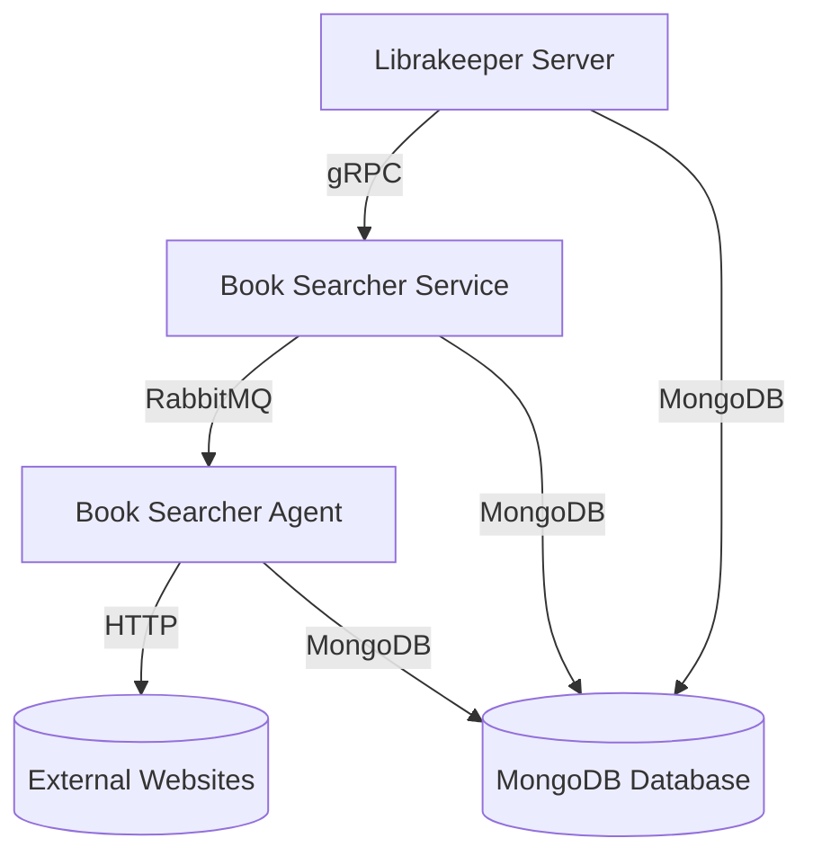

# Librakeeper Server

*― A Robust Backend System for a Personal Book Library*

Librakeeper Server is a backend system designed for managing a personal book library. It provides a robust set of
features, including user authentication, book management, bookshelf organization, and advanced search capabilities. The
system is built using a microservices architecture with asynchronous processing, ensuring efficient and scalable
operations.

## Key Features

* **User Authentication:** Secure authentication using Firebase.
* **Book Management:** Add, view, update, and delete books with detailed information (ISBN, title, author, publishing,
  description, cover image, and shop).
* **Bookshelf Organization:** Create and manage personalized bookshelves to categorize books.
* **Search Functionality:**  Find books by ISBN using simple (local database) or advanced (gRPC-based) search.
* **Microservice Architecture:**  Leverage gRPC for efficient communication between the server, searcher, and
  searcher-agent microservices.
* **Asynchronous Processing:** Utilize RabbitMQ for asynchronous book searching and processing.
* **Persistent Storage:**  Store book and bookshelf data in a MongoDB database.
* **Containerization:**  Easy deployment and setup using Docker and Docker Compose.

## API Documentation

For detailed information about the Librakeeper Server API, including available endpoints, data structures, and
authentication requirements, please refer to the comprehensive [API documentation](API.md).

## Architecture Overview

The system follows a microservice architecture, with components communicating via gRPC and RabbitMQ.



## Getting Started

Here's how to set up and run Librakeeper Server locally:

### Prerequisites

* **Go:**  [https://golang.org/](https://golang.org/)
* **Docker:**  [https://www.docker.com/](https://www.docker.com/)
* **Docker Compose:**  [https://docs.docker.com/compose/](https://docs.docker.com/compose/)
* **MongoDB:**  [https://www.mongodb.com/](https://www.mongodb.com/)

### Configuration

1. **Configuration Files:**
    - Configure the server, searcher, and searcher-agent microservices using the provided YAML configuration files (
      e.g., `config/server/docker-local.yaml`).
    - Update database connection details, RabbitMQ settings, and other relevant parameters in these files.
2. **Firebase Credentials:**
    - Obtain Firebase service account credentials (a JSON file).
    - Place the credentials file in the `config/server` directory and reference it in the server's configuration
      file (`auth.config_path`).

### Installation

1. **Clone the Repository:**
   ```bash
   git clone https://github.com/your-username/librakeeper-server.git
   cd librakeeper-server
   ```
2. **Start Services:**
    ```bash
    docker-compose up -d
    ```

### Running the Server

Once the services are up and running, the Librakeeper Server will be accessible at `http://localhost:8080`.
